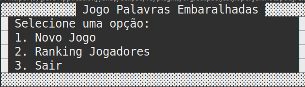

# Jogo de Palavras Embaralhadas

Este é um jogo simples de palavras embaralhadas desenvolvido em Java. O jogo inclui um banco de palavras, diferentes estratégias de embaralhamento, uma mecânica de jogo simples e a capacidade de acompanhar o ranking dos jogadores.

## Estrutura do Projeto

### `BancoDePalavras`

Esta classe é responsável pela manipulação do banco de palavras. Ela cria uma tabela no banco de dados SQLite para armazenar as palavras, insere as palavras no banco e fornece uma função para obter uma palavra aleatória do banco.

### `SQLiteConnection`

Esta classe estabelece a conexão com o banco de dados SQLite. Ela contém métodos para conectar e desconectar do banco, além de executar consultas SQL.

### `Embaralhador`

Interface que define o contrato para as classes de embaralhamento.

### `EmbaralhadorRandom`, `EmbaralhadorReverso`, `EmbaralhadorSimples`

Implementações específicas da interface `Embaralhador`. Cada classe representa uma estratégia diferente para embaralhar as palavras.

### `FabricaEmbaralhadores`

Esta fábrica cria instâncias de embaralhadores de forma aleatória.

### `FabricaMecanicaDoJogo`

Fábrica que fornece uma instância da mecânica do jogo.

### `MecanicaDoJogo`, `MecanicaDoJogoSimples`, `MecanicaDoJogoDinamica`

Interface e implementação da mecânica do jogo. A mecânica inclui a lógica para determinar se o jogo acabou e se o jogador acertou ou errou a palavra. MecanicaDoJogoDinamica utiliza implementações de vários embaralhadores (EmbaralhadorRandom ou EmbaralhadorReverso ou EmbaralhadorSimples) de forma aleatoria.

### `Player`

Classe que representa um jogador. Armazena o nome do jogador, pontuação e corações (vidas). Também fornece métodos para aumentar a pontuação e manipular as vidas do jogador.

### `Principal`

A classe principal que inicia o jogo. Ela apresenta um menu ao usuário, permite a criação de um jogador e controla o fluxo do jogo, exibindo a interface do usuário e interagindo com as classes relacionadas ao jogo.

## Como Jogar

1. Execute a classe `Principal`.
2. Escolha a opção "Novo Jogo".
3. Digite um nome para o jogador.
4. O jogo começará, exibindo a palavra embaralhada e a interface do jogador.
5. Digite a palavra desembaralhada.
6. O jogo continuará até que o jogador acerte a palavra ou perca todas as vidas.
7. O jogo mostrará a pontuação final e a opção de reiniciar ou sair.

## Notas Adicionais

- As palavras estão armazenadas em um banco de dados SQLite.
- As estratégias de embaralhamento incluem embaralhamento aleatório, reverso e simples (troca de metades).
- O jogo mantém um histórico simples dos jogadores.

Divirta-se jogando palavras embaralhadas!